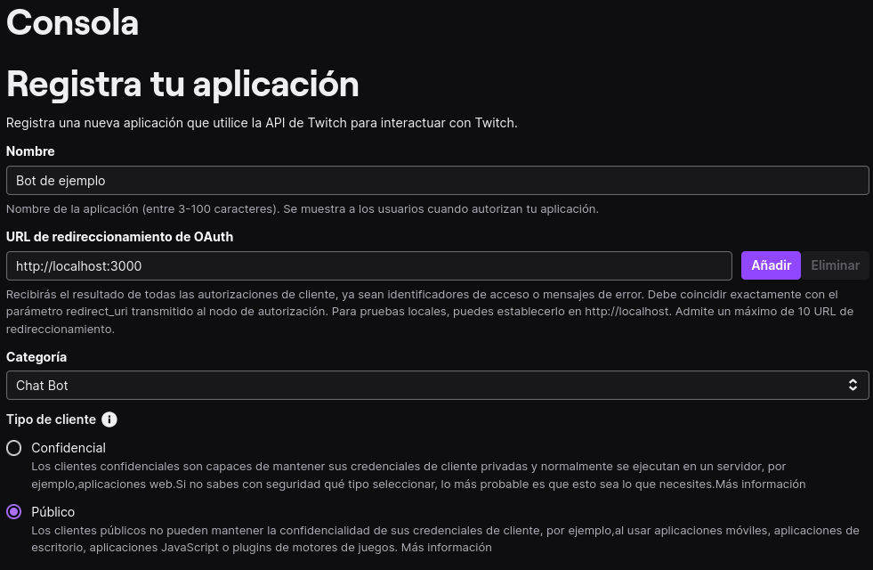
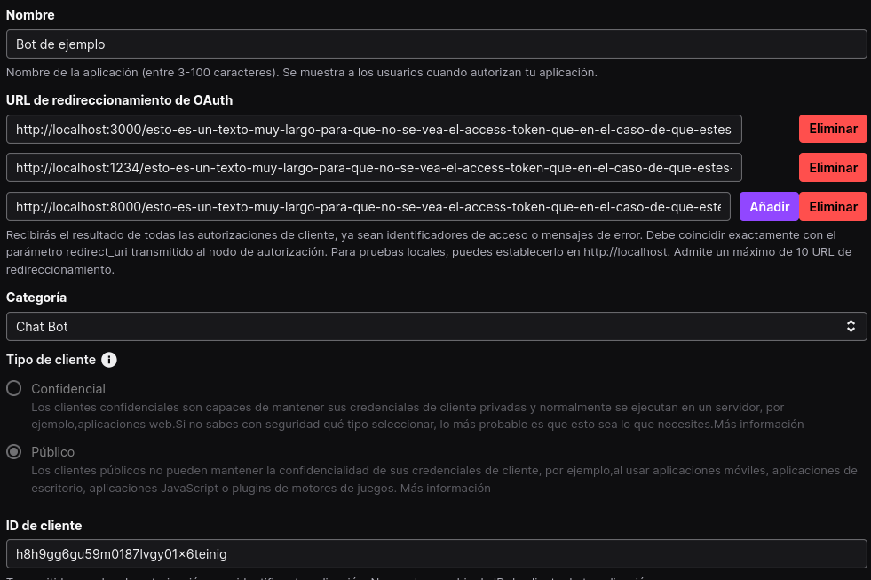

# Colgado

***Language***
- 🇺🇸 English
- [🇪🇸 Español](./README.es.md)

A game to play on Twitch based on the classic hangman game, where the chat has to guess a word previously entered by the streamer.

## Instructions
### Compile the code
If you already have the executable, you can skip this step and go directly to the application creation section.
1. Clone the repository (If you don't have git installed, press the "Code" button and "Download ZIP")
2. Install Rust, follow the official installation guide https://www.rust-lang.org/tools/install .
3. Compile the program, open the command console and execute the following command:
```bash
cargo build --release
```
4. Go to the `target/release` directory, the executable is called `colgado` if you're on Linux or `colgado.exe` on Windows.
```


### Creating a Twitch App

To do this, simply go to https://dev.twitch.tv/console/apps/create and fill it out as follows and click "Create":


Once done, you'll be on the page https://dev.twitch.tv/console/apps where your created applications appear.

Click the "Manage" button of your bot; on this screen, you'll see the client ID and redirection URLs (in our case, only one).

In the same directory from which we run the game, we create the following file, naming it "env.toml", keeping in mind that "toml" is the extension:

In it:

- We enter our bot's client-ID; it's public, so there's no problem sharing it.

- Text has been added because when you log in, a token will appear in the URL that **should not be shared with anyone**.

- `command` is the word that will be used to distinguish messages related to the game from others.

We modify our bot's URL and add the other two.


## What to do if my token is leaked

Go to this address https://www.twitch.tv/settings/connections and in the "Other Connections" section, click the "Disconnect" button for the bot.
